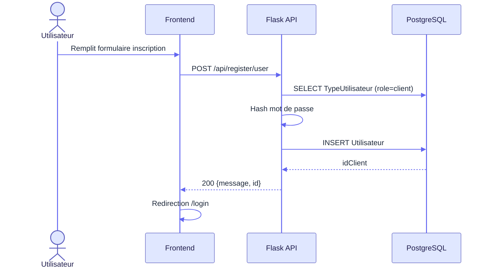
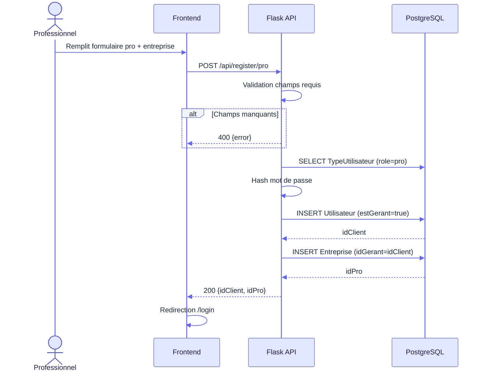
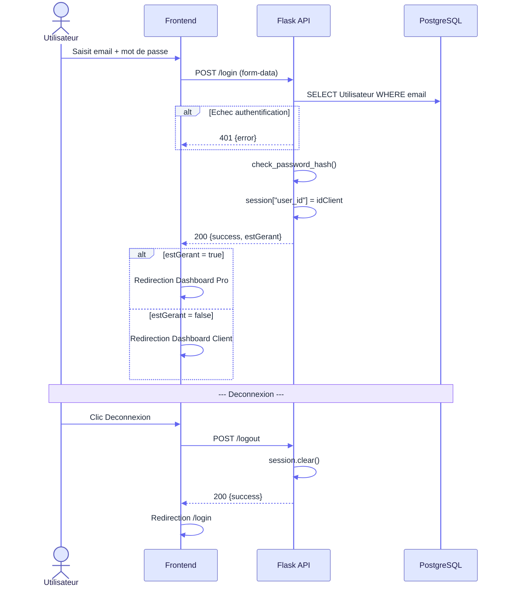

# Sequences - Authentification

## Inscription Client

```mermaid
%%{init: {'theme': 'base', 'themeVariables': {'actorBkg': '#e0e7ff', 'actorTextColor': '#1e1b4b', 'actorLineColor': '#6366f1', 'signalColor': '#6366f1', 'signalTextColor': '#1e293b', 'labelBoxBkgColor': '#f1f5f9', 'labelBoxBorderColor': '#6366f1', 'labelTextColor': '#1e293b', 'loopTextColor': '#1e293b', 'noteBkgColor': '#ede9fe', 'noteTextColor': '#1e293b', 'noteBorderColor': '#8b5cf6', 'activationBkgColor': '#dbeafe', 'activationBorderColor': '#3b82f6', 'sequenceNumberColor': '#1e293b', 'participantBkg': '#e0e7ff', 'participantTextColor': '#1e1b4b', 'participantBorder': '#6366f1', 'mainBkg': '#ffffff', 'background': '#ffffff', 'primaryColor': '#6366f1', 'primaryTextColor': '#1e293b', 'lineColor': '#6366f1', 'textColor': '#1e293b'}}}%%
sequenceDiagram
    actor U as Utilisateur
    participant F as Frontend
    participant B as Flask API
    participant DB as PostgreSQL

    U->>F: Remplit formulaire inscription
    F->>B: POST /api/register/user
    B->>DB: SELECT TypeUtilisateur (role=client)
    B->>B: Hash mot de passe
    B->>DB: INSERT Utilisateur
    DB-->>B: idClient
    B-->>F: 200 {message, id}
    F->>F: Redirection /login
```

## Inscription Professionnel

```mermaid
%%{init: {'theme': 'base', 'themeVariables': {'actorBkg': '#e0e7ff', 'actorTextColor': '#1e1b4b', 'actorLineColor': '#6366f1', 'signalColor': '#6366f1', 'signalTextColor': '#1e293b', 'labelBoxBkgColor': '#f1f5f9', 'labelBoxBorderColor': '#6366f1', 'labelTextColor': '#1e293b', 'loopTextColor': '#1e293b', 'noteBkgColor': '#ede9fe', 'noteTextColor': '#1e293b', 'noteBorderColor': '#8b5cf6', 'activationBkgColor': '#dbeafe', 'activationBorderColor': '#3b82f6', 'sequenceNumberColor': '#1e293b', 'participantBkg': '#e0e7ff', 'participantTextColor': '#1e1b4b', 'participantBorder': '#6366f1', 'mainBkg': '#ffffff', 'background': '#ffffff', 'primaryColor': '#6366f1', 'primaryTextColor': '#1e293b', 'lineColor': '#6366f1', 'textColor': '#1e293b'}}}%%
sequenceDiagram
    actor U as Professionnel
    participant F as Frontend
    participant B as Flask API
    participant DB as PostgreSQL

    U->>F: Remplit formulaire pro + entreprise
    F->>B: POST /api/register/pro
    B->>B: Validation champs requis
    alt Champs manquants
        B-->>F: 400 {error}
    end
    B->>DB: SELECT TypeUtilisateur (role=pro)
    B->>B: Hash mot de passe
    B->>DB: INSERT Utilisateur (estGerant=true)
    DB-->>B: idClient
    B->>DB: INSERT Entreprise (idGerant=idClient)
    DB-->>B: idPro
    B-->>F: 200 {idClient, idPro}
    F->>F: Redirection /login
```

## Connexion / Deconnexion

```mermaid
%%{init: {'theme': 'base', 'themeVariables': {'actorBkg': '#e0e7ff', 'actorTextColor': '#1e1b4b', 'actorLineColor': '#6366f1', 'signalColor': '#6366f1', 'signalTextColor': '#1e293b', 'labelBoxBkgColor': '#f1f5f9', 'labelBoxBorderColor': '#6366f1', 'labelTextColor': '#1e293b', 'loopTextColor': '#1e293b', 'noteBkgColor': '#ede9fe', 'noteTextColor': '#1e293b', 'noteBorderColor': '#8b5cf6', 'activationBkgColor': '#dbeafe', 'activationBorderColor': '#3b82f6', 'sequenceNumberColor': '#1e293b', 'participantBkg': '#e0e7ff', 'participantTextColor': '#1e1b4b', 'participantBorder': '#6366f1', 'mainBkg': '#ffffff', 'background': '#ffffff', 'primaryColor': '#6366f1', 'primaryTextColor': '#1e293b', 'lineColor': '#6366f1', 'textColor': '#1e293b'}}}%%
sequenceDiagram
    actor U as Utilisateur
    participant F as Frontend
    participant B as Flask API
    participant DB as PostgreSQL

    U->>F: Saisit email + mot de passe
    F->>B: POST /login (form-data)
    B->>DB: SELECT Utilisateur WHERE email
    alt Echec authentification
        B-->>F: 401 {error}
    end
    B->>B: check_password_hash()
    B->>B: session["user_id"] = idClient
    B-->>F: 200 {success, estGerant}
    alt estGerant = true
        F->>F: Redirection Dashboard Pro
    else estGerant = false
        F->>F: Redirection Dashboard Client
    end

    Note over U,DB: --- Deconnexion ---

    U->>F: Clic Deconnexion
    F->>B: POST /logout
    B->>B: session.clear()
    B-->>F: 200 {success}
    F->>F: Redirection /login
```
