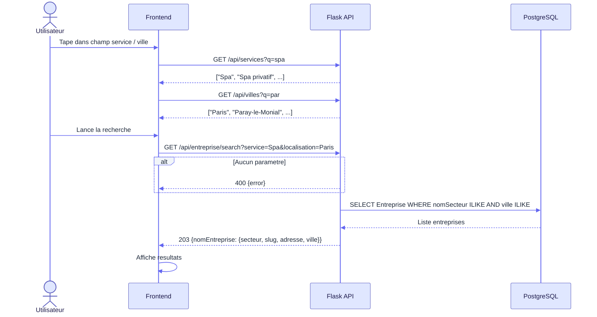
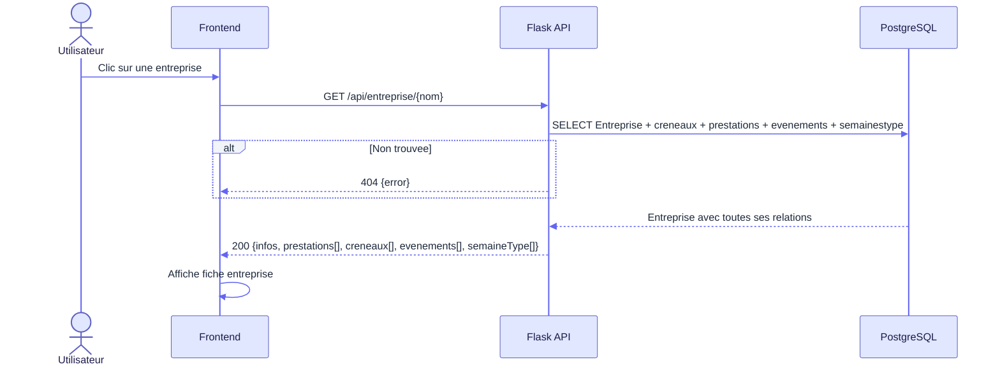

# Sequences - Recherche & Consultation

## Recherche d'Entreprises

```mermaid
%%{init: {'theme': 'base', 'themeVariables': {'actorBkg': '#e0e7ff', 'actorTextColor': '#1e1b4b', 'actorLineColor': '#6366f1', 'signalColor': '#6366f1', 'signalTextColor': '#1e293b', 'labelBoxBkgColor': '#f1f5f9', 'labelBoxBorderColor': '#6366f1', 'labelTextColor': '#1e293b', 'loopTextColor': '#1e293b', 'noteBkgColor': '#ede9fe', 'noteTextColor': '#1e293b', 'noteBorderColor': '#8b5cf6', 'activationBkgColor': '#dbeafe', 'activationBorderColor': '#3b82f6', 'sequenceNumberColor': '#1e293b', 'participantBkg': '#e0e7ff', 'participantTextColor': '#1e1b4b', 'participantBorder': '#6366f1', 'mainBkg': '#ffffff', 'background': '#ffffff', 'primaryColor': '#6366f1', 'primaryTextColor': '#1e293b', 'lineColor': '#6366f1', 'textColor': '#1e293b'}}}%%
sequenceDiagram
    actor U as Utilisateur
    participant F as Frontend
    participant B as Flask API
    participant DB as PostgreSQL

    U->>F: Tape dans champ service / ville
    F->>B: GET /api/services?q=spa
    B-->>F: ["Spa", "Spa privatif", ...]
    F->>B: GET /api/villes?q=par
    B-->>F: ["Paris", "Paray-le-Monial", ...]

    U->>F: Lance la recherche
    F->>B: GET /api/entreprise/search?service=Spa&localisation=Paris
    alt Aucun parametre
        B-->>F: 400 {error}
    end
    B->>DB: SELECT Entreprise WHERE nomSecteur ILIKE AND ville ILIKE
    DB-->>B: Liste entreprises
    B-->>F: 203 {nomEntreprise: {secteur, slug, adresse, ville}}
    F->>F: Affiche resultats
```

## Detail d'une Entreprise

```mermaid
%%{init: {'theme': 'base', 'themeVariables': {'actorBkg': '#e0e7ff', 'actorTextColor': '#1e1b4b', 'actorLineColor': '#6366f1', 'signalColor': '#6366f1', 'signalTextColor': '#1e293b', 'labelBoxBkgColor': '#f1f5f9', 'labelBoxBorderColor': '#6366f1', 'labelTextColor': '#1e293b', 'loopTextColor': '#1e293b', 'noteBkgColor': '#ede9fe', 'noteTextColor': '#1e293b', 'noteBorderColor': '#8b5cf6', 'activationBkgColor': '#dbeafe', 'activationBorderColor': '#3b82f6', 'sequenceNumberColor': '#1e293b', 'participantBkg': '#e0e7ff', 'participantTextColor': '#1e1b4b', 'participantBorder': '#6366f1', 'mainBkg': '#ffffff', 'background': '#ffffff', 'primaryColor': '#6366f1', 'primaryTextColor': '#1e293b', 'lineColor': '#6366f1', 'textColor': '#1e293b'}}}%%
sequenceDiagram
    actor U as Utilisateur
    participant F as Frontend
    participant B as Flask API
    participant DB as PostgreSQL

    U->>F: Clic sur une entreprise
    F->>B: GET /api/entreprise/{nom}
    B->>DB: SELECT Entreprise + creneaux + prestations + evenements + semainestype
    alt Non trouvee
        B-->>F: 404 {error}
    end
    DB-->>B: Entreprise avec toutes ses relations
    B-->>F: 200 {infos, prestations[], creneaux[], evenements[], semaineType[]}
    F->>F: Affiche fiche entreprise
```
