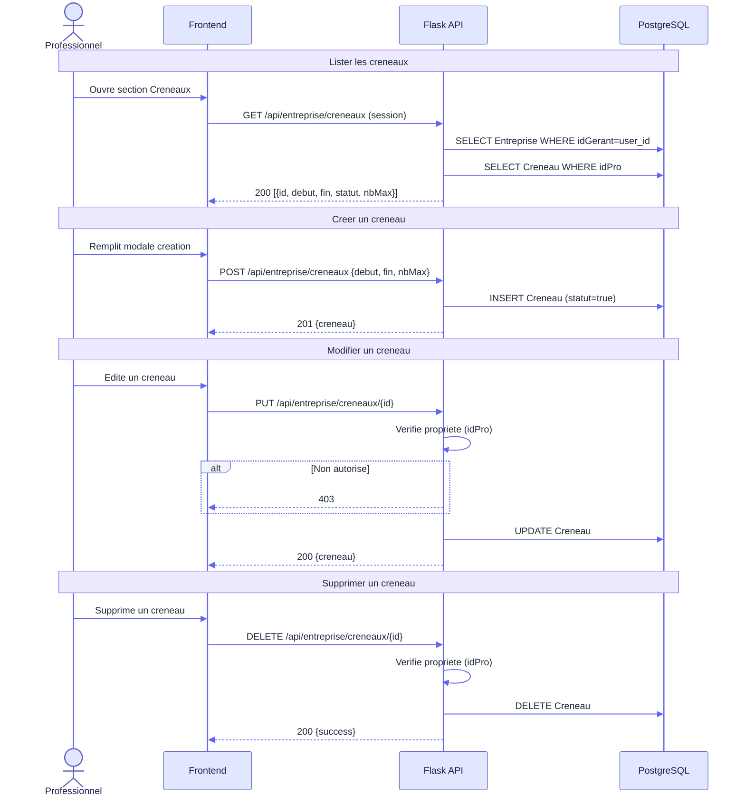
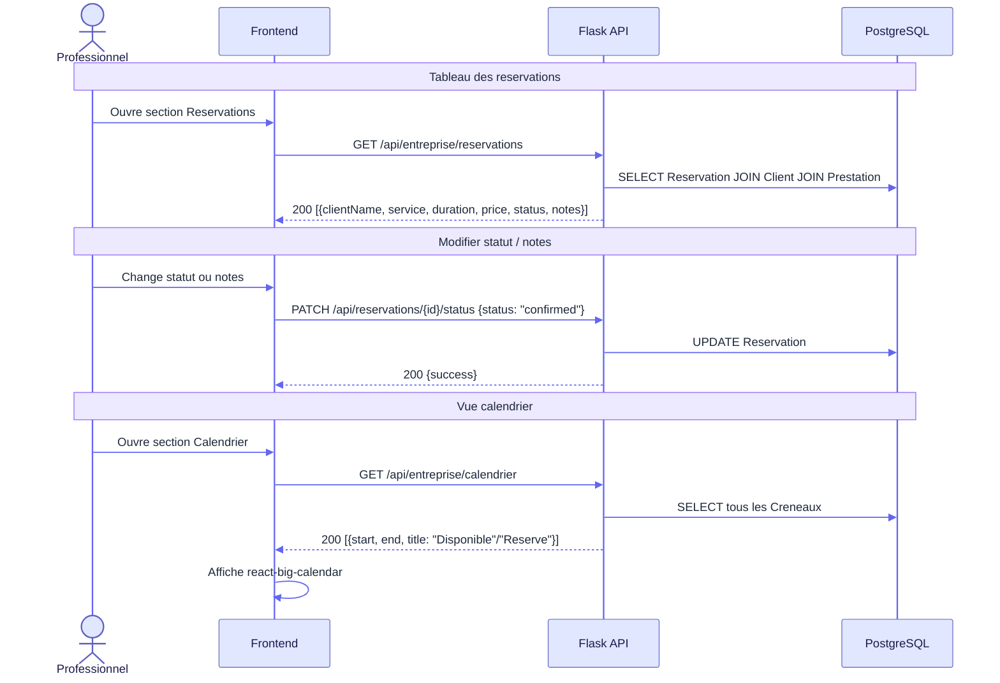
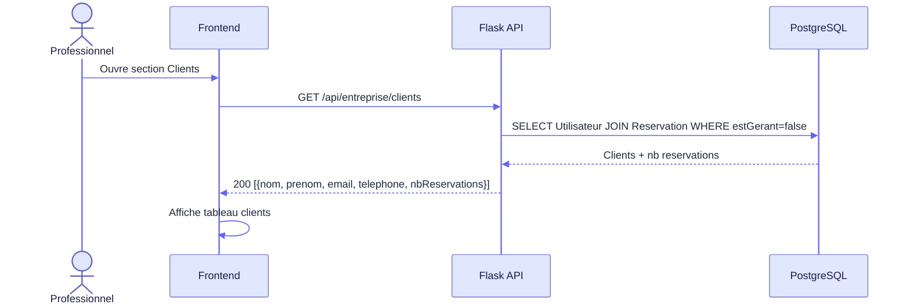

# Sequences - Dashboard Professionnel

## Gestion des Creneaux

```mermaid
%%{init: {'theme': 'base', 'themeVariables': {'actorBkg': '#e0e7ff', 'actorTextColor': '#1e1b4b', 'actorLineColor': '#6366f1', 'signalColor': '#6366f1', 'signalTextColor': '#1e293b', 'labelBoxBkgColor': '#f1f5f9', 'labelBoxBorderColor': '#6366f1', 'labelTextColor': '#1e293b', 'loopTextColor': '#1e293b', 'noteBkgColor': '#ede9fe', 'noteTextColor': '#1e293b', 'noteBorderColor': '#8b5cf6', 'activationBkgColor': '#dbeafe', 'activationBorderColor': '#3b82f6', 'sequenceNumberColor': '#1e293b', 'participantBkg': '#e0e7ff', 'participantTextColor': '#1e1b4b', 'participantBorder': '#6366f1', 'mainBkg': '#ffffff', 'background': '#ffffff', 'primaryColor': '#6366f1', 'primaryTextColor': '#1e293b', 'lineColor': '#6366f1', 'textColor': '#1e293b'}}}%%
sequenceDiagram
    actor P as Professionnel
    participant F as Frontend
    participant B as Flask API
    participant DB as PostgreSQL

    Note over P,DB: Lister les creneaux
    P->>F: Ouvre section Creneaux
    F->>B: GET /api/entreprise/creneaux (session)
    B->>DB: SELECT Entreprise WHERE idGerant=user_id
    B->>DB: SELECT Creneau WHERE idPro
    B-->>F: 200 [{id, debut, fin, statut, nbMax}]

    Note over P,DB: Creer un creneau
    P->>F: Remplit modale creation
    F->>B: POST /api/entreprise/creneaux {debut, fin, nbMax}
    B->>DB: INSERT Creneau (statut=true)
    B-->>F: 201 {creneau}

    Note over P,DB: Modifier un creneau
    P->>F: Edite un creneau
    F->>B: PUT /api/entreprise/creneaux/{id}
    B->>B: Verifie propriete (idPro)
    alt Non autorise
        B-->>F: 403
    end
    B->>DB: UPDATE Creneau
    B-->>F: 200 {creneau}

    Note over P,DB: Supprimer un creneau
    P->>F: Supprime un creneau
    F->>B: DELETE /api/entreprise/creneaux/{id}
    B->>B: Verifie propriete (idPro)
    B->>DB: DELETE Creneau
    B-->>F: 200 {success}
```

## Reservations & Calendrier

```mermaid
%%{init: {'theme': 'base', 'themeVariables': {'actorBkg': '#e0e7ff', 'actorTextColor': '#1e1b4b', 'actorLineColor': '#6366f1', 'signalColor': '#6366f1', 'signalTextColor': '#1e293b', 'labelBoxBkgColor': '#f1f5f9', 'labelBoxBorderColor': '#6366f1', 'labelTextColor': '#1e293b', 'loopTextColor': '#1e293b', 'noteBkgColor': '#ede9fe', 'noteTextColor': '#1e293b', 'noteBorderColor': '#8b5cf6', 'activationBkgColor': '#dbeafe', 'activationBorderColor': '#3b82f6', 'sequenceNumberColor': '#1e293b', 'participantBkg': '#e0e7ff', 'participantTextColor': '#1e1b4b', 'participantBorder': '#6366f1', 'mainBkg': '#ffffff', 'background': '#ffffff', 'primaryColor': '#6366f1', 'primaryTextColor': '#1e293b', 'lineColor': '#6366f1', 'textColor': '#1e293b'}}}%%
sequenceDiagram
    actor P as Professionnel
    participant F as Frontend
    participant B as Flask API
    participant DB as PostgreSQL

    Note over P,DB: Tableau des reservations
    P->>F: Ouvre section Reservations
    F->>B: GET /api/entreprise/reservations
    B->>DB: SELECT Reservation JOIN Client JOIN Prestation
    B-->>F: 200 [{clientName, service, duration, price, status, notes}]

    Note over P,DB: Modifier statut / notes
    P->>F: Change statut ou notes
    F->>B: PATCH /api/reservations/{id}/status {status: "confirmed"}
    B->>DB: UPDATE Reservation
    B-->>F: 200 {success}

    Note over P,DB: Vue calendrier
    P->>F: Ouvre section Calendrier
    F->>B: GET /api/entreprise/calendrier
    B->>DB: SELECT tous les Creneaux
    B-->>F: 200 [{start, end, title: "Disponible"/"Reserve"}]
    F->>F: Affiche react-big-calendar
```

## Liste des Clients

```mermaid
%%{init: {'theme': 'base', 'themeVariables': {'actorBkg': '#e0e7ff', 'actorTextColor': '#1e1b4b', 'actorLineColor': '#6366f1', 'signalColor': '#6366f1', 'signalTextColor': '#1e293b', 'labelBoxBkgColor': '#f1f5f9', 'labelBoxBorderColor': '#6366f1', 'labelTextColor': '#1e293b', 'loopTextColor': '#1e293b', 'noteBkgColor': '#ede9fe', 'noteTextColor': '#1e293b', 'noteBorderColor': '#8b5cf6', 'activationBkgColor': '#dbeafe', 'activationBorderColor': '#3b82f6', 'sequenceNumberColor': '#1e293b', 'participantBkg': '#e0e7ff', 'participantTextColor': '#1e1b4b', 'participantBorder': '#6366f1', 'mainBkg': '#ffffff', 'background': '#ffffff', 'primaryColor': '#6366f1', 'primaryTextColor': '#1e293b', 'lineColor': '#6366f1', 'textColor': '#1e293b'}}}%%
sequenceDiagram
    actor P as Professionnel
    participant F as Frontend
    participant B as Flask API
    participant DB as PostgreSQL

    P->>F: Ouvre section Clients
    F->>B: GET /api/entreprise/clients
    B->>DB: SELECT Utilisateur JOIN Reservation WHERE estGerant=false
    DB-->>B: Clients + nb reservations
    B-->>F: 200 [{nom, prenom, email, telephone, nbReservations}]
    F->>F: Affiche tableau clients
```
