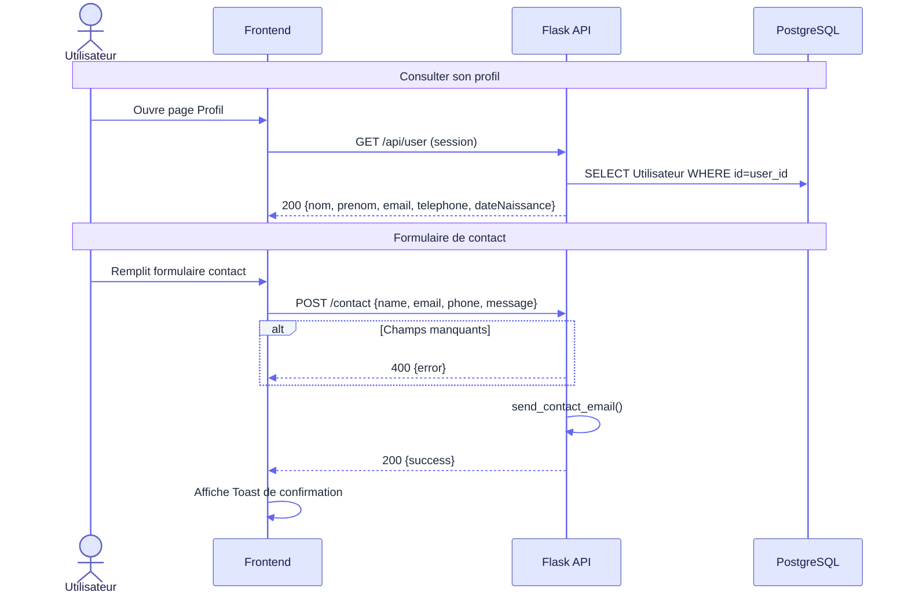
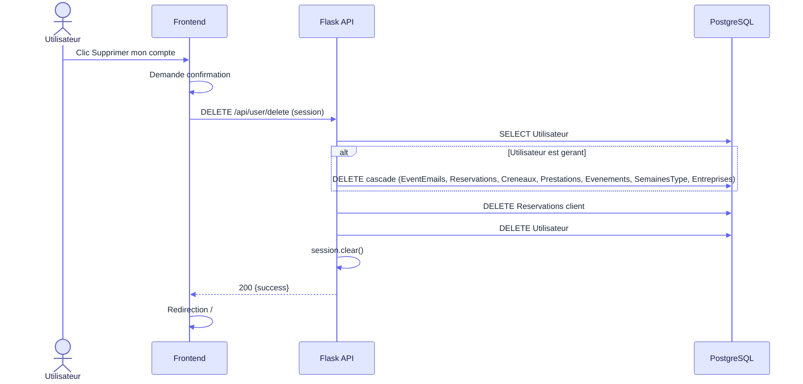

# Sequences - Gestion du Compte

## Profil & Contact

```mermaid
%%{init: {'theme': 'base', 'themeVariables': {'actorBkg': '#e0e7ff', 'actorTextColor': '#1e1b4b', 'actorLineColor': '#6366f1', 'signalColor': '#6366f1', 'signalTextColor': '#1e293b', 'labelBoxBkgColor': '#f1f5f9', 'labelBoxBorderColor': '#6366f1', 'labelTextColor': '#1e293b', 'loopTextColor': '#1e293b', 'noteBkgColor': '#ede9fe', 'noteTextColor': '#1e293b', 'noteBorderColor': '#8b5cf6', 'activationBkgColor': '#dbeafe', 'activationBorderColor': '#3b82f6', 'sequenceNumberColor': '#1e293b', 'participantBkg': '#e0e7ff', 'participantTextColor': '#1e1b4b', 'participantBorder': '#6366f1', 'mainBkg': '#ffffff', 'background': '#ffffff', 'primaryColor': '#6366f1', 'primaryTextColor': '#1e293b', 'lineColor': '#6366f1', 'textColor': '#1e293b'}}}%%
sequenceDiagram
    actor U as Utilisateur
    participant F as Frontend
    participant B as Flask API
    participant DB as PostgreSQL

    Note over U,DB: Consulter son profil
    U->>F: Ouvre page Profil
    F->>B: GET /api/user (session)
    B->>DB: SELECT Utilisateur WHERE id=user_id
    B-->>F: 200 {nom, prenom, email, telephone, dateNaissance}

    Note over U,DB: Formulaire de contact
    U->>F: Remplit formulaire contact
    F->>B: POST /contact {name, email, phone, message}
    alt Champs manquants
        B-->>F: 400 {error}
    end
    B->>B: send_contact_email()
    B-->>F: 200 {success}
    F->>F: Affiche Toast de confirmation
```

## Suppression de Compte

```mermaid
%%{init: {'theme': 'base', 'themeVariables': {'actorBkg': '#e0e7ff', 'actorTextColor': '#1e1b4b', 'actorLineColor': '#6366f1', 'signalColor': '#6366f1', 'signalTextColor': '#1e293b', 'labelBoxBkgColor': '#f1f5f9', 'labelBoxBorderColor': '#6366f1', 'labelTextColor': '#1e293b', 'loopTextColor': '#1e293b', 'noteBkgColor': '#ede9fe', 'noteTextColor': '#1e293b', 'noteBorderColor': '#8b5cf6', 'activationBkgColor': '#dbeafe', 'activationBorderColor': '#3b82f6', 'sequenceNumberColor': '#1e293b', 'participantBkg': '#e0e7ff', 'participantTextColor': '#1e1b4b', 'participantBorder': '#6366f1', 'mainBkg': '#ffffff', 'background': '#ffffff', 'primaryColor': '#6366f1', 'primaryTextColor': '#1e293b', 'lineColor': '#6366f1', 'textColor': '#1e293b'}}}%%
sequenceDiagram
    actor U as Utilisateur
    participant F as Frontend
    participant B as Flask API
    participant DB as PostgreSQL

    U->>F: Clic Supprimer mon compte
    F->>F: Demande confirmation
    F->>B: DELETE /api/user/delete (session)
    B->>DB: SELECT Utilisateur
    alt Utilisateur est gerant
        B->>DB: DELETE cascade (EventEmails, Reservations, Creneaux, Prestations, Evenements, SemainesType, Entreprises)
    end
    B->>DB: DELETE Reservations client
    B->>DB: DELETE Utilisateur
    B->>B: session.clear()
    B-->>F: 200 {success}
    F->>F: Redirection /
```
