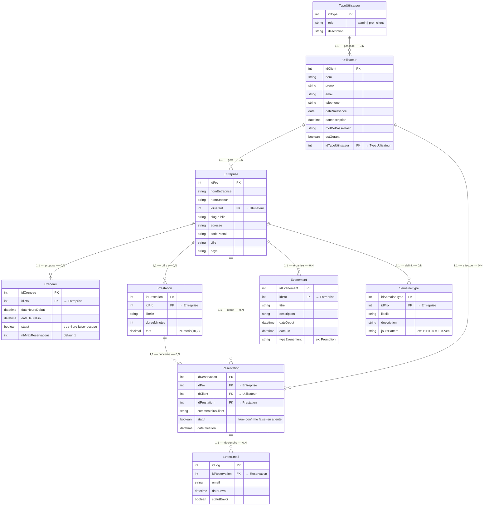

# Modele Conceptuel de Donnees - Book-By-Click

## MCD

## Cardinalites

| Relation | Entite A | Cardinalite | Verbe | Cardinalite | Entite B |
|----------|----------|:-----------:|-------|:-----------:|----------|
| 1 | **TypeUtilisateur** | 1,N | possede | 1,1 | **Utilisateur** |
| 2 | **Utilisateur** | 0,N | gere | 1,1 | **Entreprise** |
| 3 | **Utilisateur** | 0,N | effectue | 1,1 | **Reservation** |
| 4 | **Entreprise** | 0,N | propose | 1,1 | **Creneau** |
| 5 | **Entreprise** | 0,N | offre | 1,1 | **Prestation** |
| 6 | **Entreprise** | 0,N | recoit | 1,1 | **Reservation** |
| 7 | **Entreprise** | 0,N | organise | 1,1 | **Evenement** |
| 8 | **Entreprise** | 0,N | definit | 1,1 | **SemaineType** |
| 9 | **Prestation** | 0,N | concerne | 1,1 | **Reservation** |
| 10 | **Reservation** | 0,N | declenche | 1,1 | **EventEmail** |

## Regles de gestion

- Un **Utilisateur** possede exactement un **TypeUtilisateur** (admin, pro ou client)
- Un **Utilisateur** avec `estGerant=true` peut gerer 0 a N **Entreprises**
- Un **Utilisateur** client peut effectuer 0 a N **Reservations**
- Une **Entreprise** appartient a exactement 1 gerant
- Une **Entreprise** propose 0 a N **Creneaux** de disponibilite
- Une **Entreprise** offre 0 a N **Prestations** (services avec duree et tarif)
- Une **Reservation** lie obligatoirement 1 Client, 1 Entreprise et 1 Prestation
- Un **Creneau** a un statut libre/occupe et un nombre max de reservations
- Une **SemaineType** definit un pattern hebdomadaire (ex: `1111100` = Lun-Ven)
- Un **Evenement** est une promotion ou actualite liee a une entreprise
